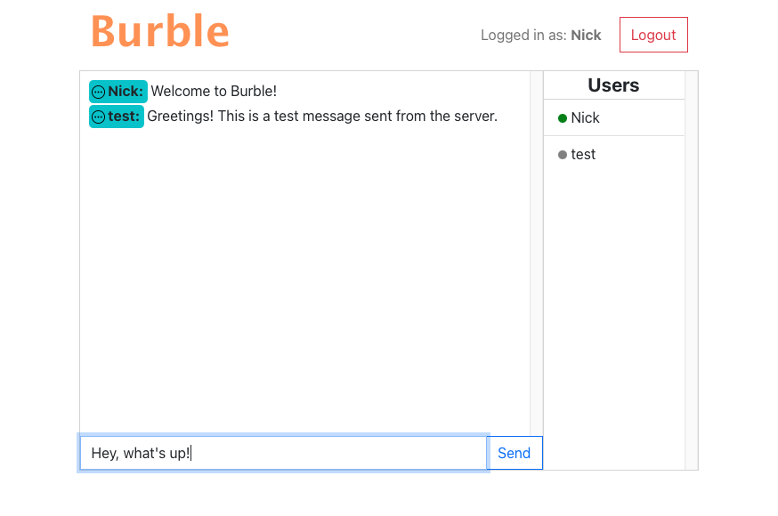

# Burble - A Chat App

<br>

_A full-stack chat application, made with a Javascript React front-end and a Python Flask back-end. Users login via api endpoints, and are connected to Socket.IO for bi-directional websocket communication to send and receive messages fluidly._

<br>

See it in action [here](https://burble.onrender.com). (Render may cause a delay in loading.)

<br>

Screenshot:<br>


## Details

### Server:

-  Python-based server using Flask
-  Uses Flask-SocketIO for bi-directional communication to and from the client
-  A JSON web token is generated for validated users which is sent to the client. Once logged in, all socket connections are verified by checking this token. This prevents unauthorized logins and maintains a users identity.
-  Connections are made to a PostgreSQL database to store and access user and message data using the psycopg2 module

### Client:

-  Made with Javascript, ReactJS and Bootstrap components
-  Access is granted upon using or creating credentials and receiving a JSON web token
-  A socket connection is made to the server, and socket events are set up in useEffect hook. User and message data is pushed to the client on load or whenever there are changes to the data.

## Skills Developed

-  How to use Socket.IO with Flask as well as in a React application.
-  Unit testing for a Python/Flask app with jest
-  Serving the client from the server
-  Creating and using JSON web tokens for secure connections
-  Learned the basics of SQL programming with a PostgreSQL database
-  How to setup a PostgreSQL database and access it from the server

## Installation Instructions

### Client

1. In client/src directory, open settings.js and change the URL to your host url.
2. At the command line in the root directory run 'cd client'.
3. Then run 'npm install' to install node package manager.
4. Run 'npm run build' to set up static files for server.

### Database

1. Create a PostgreSQL database
2. Add two tables one called users and one called messages.
3. Add columns to messages in this order: "id"(int), "username"(text), "text"(text), "date_created"(text). All values should be "not null", id should be primary and should auto increment.
4. Add columns to users in this order: "id"(int), "name"(text), "date_created"(text), "password"(text), "is_online"(boolean), "session_id"(text). All values should be "not null" except for session_id, id should be primary and should auto increment, and name should have a unique constraint.
5. Create a file in the server folder called database.ini
6. Insert your database credentials into this file in this format:

```
[postgresql]
host = host
database = database
user = user
password = password
port = port
```

### Server

1. Add another file in your server folder called .env and add your Flask Secret like this

   FLASK_SECRET=secret

2. Delete the line eventlet==0.30.2 from the requirement.txt file. It's there for deploying purposes, so you can keep it if you're deploying with gunicorn. https://flask-socketio.readthedocs.io/en/latest/deployment.html
3. At the command line navigate to your server directory
4. Run 'python3 -m venv .venv' to create a virtual environment.
5. Run 'source .venv/bin/activate' to activate virtual environment.
6. Run 'pip install -r requirements.txt' to install required packages.
7. Run 'python3 server.py'
8. Server should now be online at the URL in the terminal response.

## Author

-  **Nick Schaefer** - _Full-Stack Software Developer_ - [Website](https://www.nschaefer.com/) | [LinkedIn](https://www.linkedin.com/in/nick-n-schaefer)
